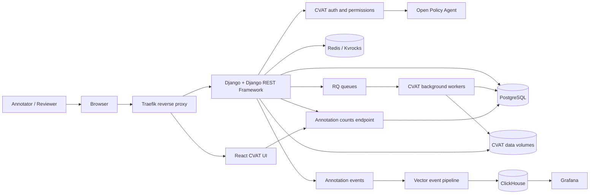
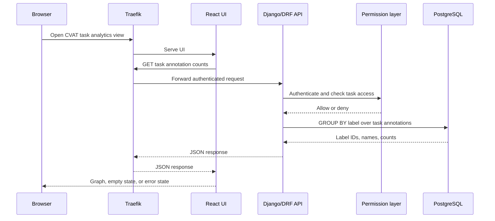
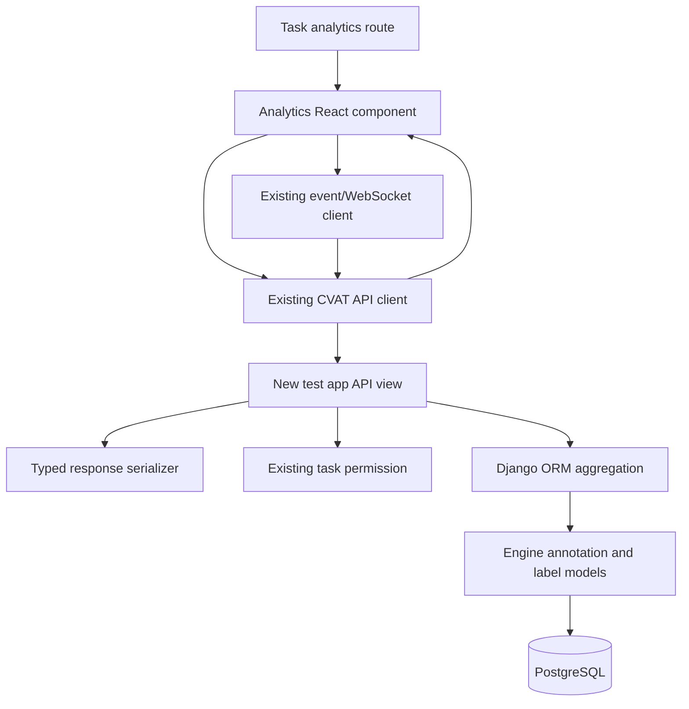

# CVAT Annotation Analytics Architecture

## 1. System purpose

CVAT is a web-based computer-vision annotation platform. Users upload images
or video, create labeled shapes, and manage annotation tasks. The annotation
analytics feature adds a task-scoped API and UI that aggregate annotations by
label and present the result as a graph.

The feature is designed as an extension of CVAT's existing architecture. It
does not introduce a second authentication system, a second database, or a
new frontend transport.

## 2. High-level architecture



The browser reaches the system through Traefik on port `8080`. Traefik routes
the root host to the UI and API/static/admin paths to the CVAT server. The API
checks authentication and task access before executing the annotation
aggregation query.

## 3. Annotation analytics request flow



The count must be calculated in the database using Django ORM aggregation.
The browser should receive aggregate results, not every annotation object.
This reduces payload size and keeps task authorization at the API boundary.

For live updates, the UI subscribes to CVAT's existing event/WebSocket
mechanism. Relevant annotation events trigger a task-scoped refetch. When the
connection returns, the UI performs a full refresh so events missed during the
disconnect cannot leave stale counts.

## 4. Runtime components

| Component | Responsibility | Technology/source |
|---|---|---|
| `traefik` | Public HTTP entrypoint and routing | Traefik `v3.6` |
| `cvat_ui` | Browser application | React `18.2`, TypeScript, Webpack |
| `cvat_server` | REST API, authentication, business logic, admin, static API paths | Python, Django `5.2`, Django REST Framework `3.17` |
| `cvat_db` | Primary relational application database | PostgreSQL `15-alpine` |
| `cvat_redis_inmem` | In-memory queues and transient state | Redis `7.2` |
| `cvat_redis_ondisk` | Persistent Redis-compatible cache | Apache Kvrocks `2.15` |
| RQ workers | Imports, exports, annotation jobs, notifications, webhooks, quality jobs, and utilities | Python RQ `1.16`, `django-rq` |
| `cvat_opa` | Policy evaluation for authorization rules | Open Policy Agent `1.12` |
| `cvat_clickhouse` | Analytics/event storage | ClickHouse `23.11` |
| `cvat_vector` | Event/log routing and transformation | Vector `0.26` |
| `cvat_grafana` | Analytics and log visualization | Grafana OSS `10.1` |
| CVAT volumes | Uploaded media, keys, logs, PostgreSQL, cache, and event persistence | Docker named volumes |

## 5. Technology stack

### Backend

- Python 3 application code.
- Django `5.2.14`.
- Django REST Framework `3.17.1`.
- Django ORM for database access and grouped annotation queries.
- `dj-rest-auth` and Django Allauth for authentication integrations.
- `django-filter` for validated query filtering.
- `drf-spectacular` for OpenAPI schema generation.
- Uvicorn for the ASGI server.
- Django RQ and RQ Scheduler for asynchronous jobs.
- `psycopg2-binary` for PostgreSQL connectivity.

### Frontend

- React `18.2.0`.
- TypeScript `5.8`.
- React Router `5.1`.
- Redux `4.1`, React Redux, and Redux Thunk for application state.
- Ant Design `5.17` for interface components.
- `react-chartjs-2` for chart rendering.
- Webpack `5` for bundling and development builds.
- ESLint, Stylelint, and Prettier-compatible repository tooling.

### Data and infrastructure

- PostgreSQL for CVAT's primary relational models.
- Redis for transient queues and state.
- Kvrocks for persistent Redis-compatible storage.
- ClickHouse for analytics/event data.
- Docker Compose for local orchestration.
- Traefik for local routing.
- Open Policy Agent for policy decisions.
- Vector and Grafana for event/log observability.

### Testing and quality

- Django/DRF backend test suite under `cvat/apps/engine/tests` and related
  application test directories.
- Frontend unit/component tests following CVAT UI conventions.
- ESLint for JavaScript/TypeScript.
- Python formatting and import tooling configured through project files.
- Docker Compose integration and manual browser verification.

## 6. Repository structure relevant to this project

```text
cvat-app/
├── cvat/
│   ├── apps/
│   │   ├── engine/                 # Task, label, job, annotation models/API
│   │   ├── events/                 # Event generation and processing
│   │   ├── quality_control/
│   │   └── ...                     # Existing Django applications
│   ├── settings/
│   └── urls.py
├── cvat-ui/
│   └── src/                        # React application and task views
├── cvat-core/                      # Shared frontend/core client logic
├── cvat-data/                      # Dataset-related frontend package
├── components/
│   └── analytics/                  # Vector/Grafana analytics configuration
├── tests/                           # Cross-component and integration tests
├── docker-compose.yml               # Local service topology
├── docs/
│   ├── Plan.md
│   ├── Objectives.md
│   ├── Definition-of-Done.md
│   └── Architecture.md
└── manage.py
```

The assessment backend code belongs in a new Django app named `test`, while
the implementation should reuse models and permission helpers from
`cvat.apps.engine`.

## 7. Planned feature placement



The planned backend boundary is:

1. Receive a task ID and optional supported label filter.
2. Authenticate using existing CVAT behavior.
3. Resolve the task and enforce task-level access.
4. Query the verified annotation model relationships.
5. Group by label and return stable rows plus a total.

The planned frontend boundary is:

1. Request the selected task's aggregate data.
2. Render loading, graph, empty, and error states.
3. Apply the additional label filter through the API.
4. Refresh after relevant events.
5. Reconnect and resynchronize after a connection drop.

## 8. Security boundaries

- Traefik exposes the local application entrypoint; it is not the feature's
  authorization layer.
- Django authentication identifies the caller.
- CVAT's existing task permission layer decides whether that caller can view
  the task.
- PostgreSQL returns only the authorized task's aggregate.
- OPA participates in CVAT's policy evaluation and must not be bypassed.
- The UI must treat authorization errors as errors, not as zero annotations.
- Query parameters must be validated and passed through ORM parameters.

## 9. Operational commands

Run these commands from `R:\task\cvat-app`:

```powershell
$env:CVAT_HOST = "localhost"
docker compose up -d
docker compose ps
docker compose logs --tail=100 cvat_server
docker compose logs --tail=100 cvat_worker_import
docker compose down
```

The local entrypoint is:

```text
http://localhost:8080
```

Do not use `docker compose down -v` for normal shutdown because named volumes
contain the database and CVAT data.
